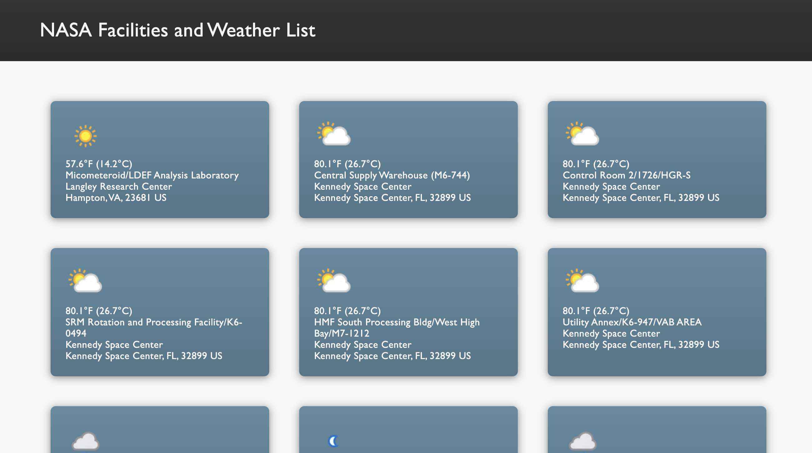

# NASA and Weather API

> View a list of all of the NASA facilities and the weather at each location.

> 

## Table of Contents

1. [Tech Stack](#tech-stack)
1. [Development](#development)
   1. [NASA and Weather APIs](#nasa-and-weather-apis)
   1. [Notes](#notes)

## Tech Stack

- **HTML**
- **CSS**
- **JavaScript**

## Development

### NASA and Weather APIs

- NASA's Facilities dataset is available at: https://data.nasa.gov/dataset/nasa-facilities-api/resource/8da12948-3793-4ec1-b5c6-f95e86fd6021, no API key required.
- A 3rd party CORS proxy (https://corsproxy.io) was used for the NASA request url to resolve CORS errors.
- Obtain a free Weather API key at: https://www.weatherapi.com/
- Update the `WEATHER_API_KEY` value with your key on line 1 of main.js.
- Open the app in your browser, and view the list of all NASA facilities including the current weather!

### Notes

Visit the official documentation at https://data.nasa.gov/dataset/nasa-facilities-api anf https://www.weatherapi.com/docs/ for more information on API use, copyright, and rate limitations.
